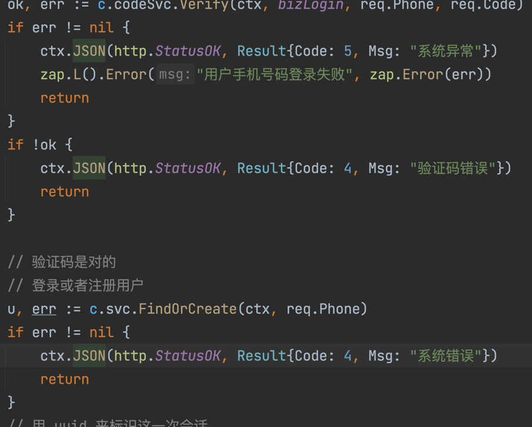

作业：优化 Web 中打印日志的部分
在 Web 的 Handler 部分，有很多 if-else 分支，基本上都是在判定 err !=nil。如下图，每一个 if 里面都要打印日志。

现在要求你优化这些打印日志的逻辑，避免每一处 err !=nil 的时候，都得手动打一个日志。
作业提交
• 截止时间：2023 年 10 月 8 日（周日）24:00（国庆假期延期一周~）
• 提交方法：将你作业的 Gitee 或 GitHub 地址填写到下方的“作业提交框”中，并点击提交即可（记得开权限哦，不然助教老师打不开~）
作业批改
• 截止时间后一周内
• 关注“极客时间训练营”公众号作业批改完成会有消息提示
